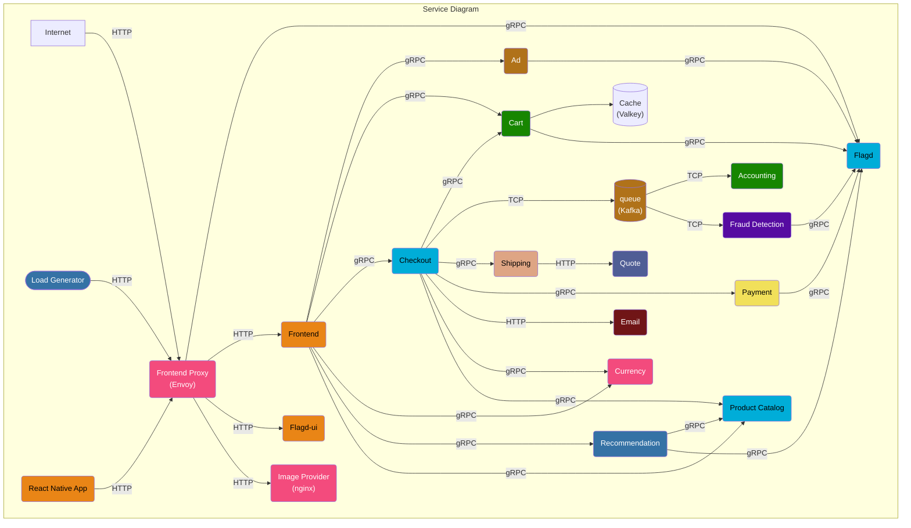
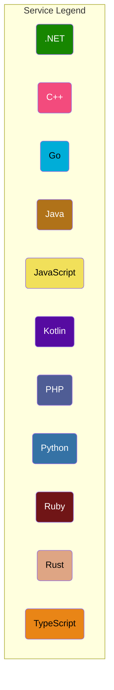

<!-- markdownlint-disable-next-line -->
#  Microservices Debugging Playground

## Welcome to the Debugging Playground

This repository contains a mock online shop, made up of microservices. 

Our goals is to provide a realistic example of a distributed system that can be used to test and demo our debugging tool.

## Quick start

Prerequisites:

- Docker
- Docker Compose v2.0.0+
- 6 GB of RAM for the application

Start the demo: 

```sh
docker compose up --force-recreate --remove-orphans --detach
```

Source: https://opentelemetry.io/docs/demo/docker-deployment/

## Links

Once the images are built and containers are started you can access:

| Title | URL |
|-------|-----|
| Web store | http://localhost:8080/ |
| Grafana | http://localhost:8080/grafana/ |
| Load Generator UI | http://localhost:8080/loadgen/ |
| Jaeger UI | http://localhost:8080/jaeger/ui/ |
| Tracetest UI | http://localhost:11633/ |
| Flagd configurator UI | http://localhost:8080/feature |

Source: [Docker deployment][docker-deployment]

## Documentation

The OpenTelemetry Demo is composed of microservices written in different
programming languages that talk to each other over gRPC and HTTP; and a load
generator which uses [Locust](https://locust.io/) to fake user traffic.

| Service                               | Language      | Description                                                                                                                          |
| ------------------------------------- | ------------- | ------------------------------------------------------------------------------------------------------------------------------------ |
| [accounting](accounting/)             | .NET          | Processes incoming orders and count the sum of all orders (mock/).                                                                   |
| [ad](ad/)                             | Java          | Provides text ads based on given context words.                                                                                      |
| [cart](cart/)                         | .NET          | Stores the items in the user's shopping cart in Valkey and retrieves it.                                                             |
| [checkout](checkout/)                 | Go            | Retrieves user cart, prepares order and orchestrates the payment, shipping and the email notification.                               |
| [currency](currency/)                 | C++           | Converts one money amount to another currency. Uses real values fetched from European Central Bank. It's the highest QPS service.    |
| [email](email/)                       | Ruby          | Sends users an order confirmation email (mock/).                                                                                     |
| [fraud-detection](fraud-detection/)   | Kotlin        | Analyzes incoming orders and detects fraud attempts (mock/).                                                                         |
| [frontend](frontend/)                 | TypeScript    | Exposes an HTTP server to serve the website. Does not require sign up / login and generates session IDs for all users automatically. |
| [load-generator](load-generator/)     | Python/Locust | Continuously sends requests imitating realistic user shopping flows to the frontend.                                                 |
| [payment](payment/)                   | JavaScript    | Charges the given credit card info (mock/) with the given amount and returns a transaction ID.                                       |
| [product-catalog](product-catalog/)   | Go            | Provides the list of products from a JSON file and ability to search products and get individual products.                           |
| [quote](quote/)                       | PHP           | Calculates the shipping costs, based on the number of items to be shipped.                                                           |
| [recommendation](recommendation/)     | Python        | Recommends other products based on what's given in the cart.                                                                         |
| [shipping](shipping/)                 | Rust          | Gives shipping cost estimates based on the shopping cart. Ships items to the given address (mock/).                                  |
| [react-native-app](react-native-app/) | TypeScript    | React Native mobile application that provides a UI on top of the shopping services.                                                  |

Source: [Services][services]





Source: [Architecture][architecture]

[docs]: https://opentelemetry.io/docs/demo/
[services]: https://opentelemetry.io/docs/demo/services/
[docker-deployment]: https://opentelemetry.io/docs/demo/docker-deployment/
[architecture]: https://opentelemetry.io/docs/demo/architecture/